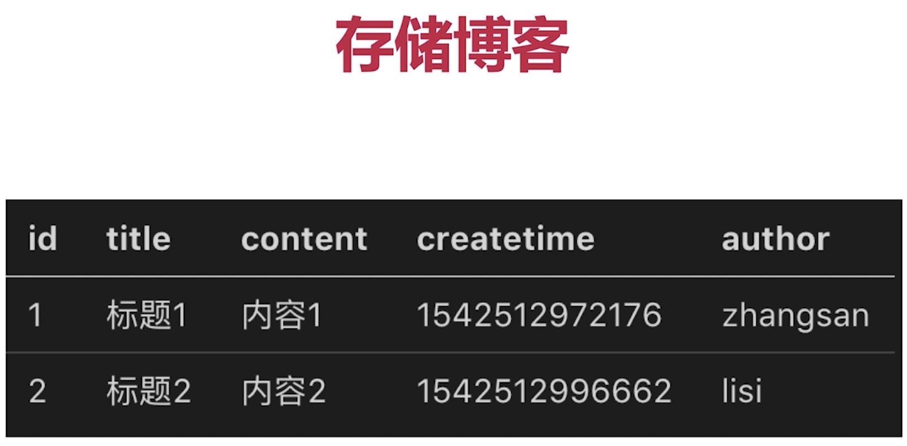
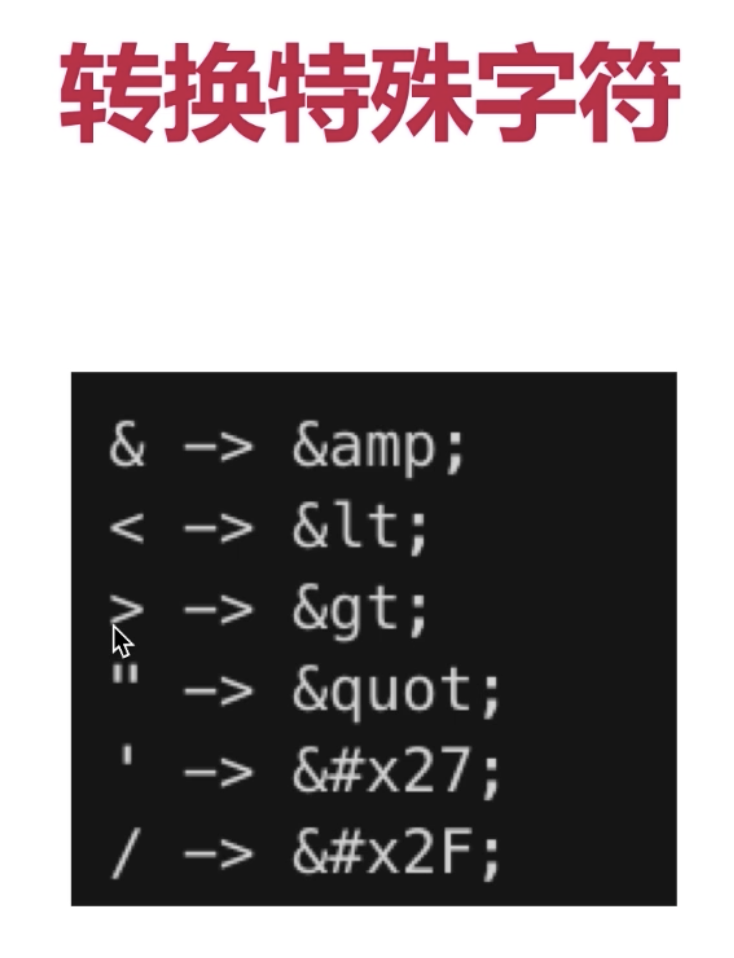

# Node

## Node环境

### Node Npm Nvm 和yarn homebrew

1. 三者关系: nvm切换不同版本的node, node自带npm

    Mac : 'brew install nvm'
    windows: github 搜索 'nvm-windows' 下载

2. 终端指令

      1. `open .nvm`: 打开nvm文件 -> versions -> node -> v10.15.3(代表node版本) -> lib(node_modules代表全局包)

      2. nvm切换下node的全局包也会切换, 都放在自己node目录下, 安装全局包时候不需要管理员权限

3. Nvm指令

      1. `nvm list`: 列出安装的所有node版本

      2. `nvm install v10.13.0`: 安装需要的版本(总归四个长期维护版本)

      3. `nvm use --delete-prefix 10.13.0`: 切换需要的版本

      4. 博客: `https://www.jianshu.com/p/622ad36ee020`(解决了安装问题)

      5. 博客: `https://www.jianshu.com/p/04d31f6c22bd`(解决了安装问题)

4. npm指令

      1. `npm install -g jshint`: 安装全局包

      2. `npm uninstall -g jshint`: 拆卸全局包

      3. `npm update -g jshint`: 更新全局包

      4. 官网: `https://www.npmjs.cn/`

      5. npm安装太慢, 可以使用淘宝镜像: `npm i webpack --save --registry=https://registry.npm.taobao.org` 重点是后面那句

      6. 淘宝镜像官网: `https://npm.taobao.org/`

#### yarn(管理全局包)

1. yarn

    1. 指令

        1. `yarn global add webpack`: 安装全局包

        2. `yarn global dir`: 全局包所在位置

        3. 更新全局包, cd到全局包所在位置, `yarn global upgrade webpack`(cd到那才有效, npm不需要)

        4. `yarn global remove webpack`: 拆卸全局包

        5. 官网: `https://yarn.bootcss.com/docs/usage/`

#### homebrew(MacOS的软件管理)

1. 指令

    1. `open /usr/local/Cellar`: brew安装的所有包都在这

    2. `brew install yarn cde`: 因为nvm管理和下载node, 所有brew在下载yarn的时候必须忽略安装node

    3. 因为yarn是由brew 安装, 所以yarn也在brew安装目录下(yarn安装的全局包不在)

    4. 官网: `https://brew.sh`

    5. homebrew指令
        1. 查看可运行的服务: `brew services`

        2. 查看哪些由homebrew运行的进程: `brew services list`

        3. 运行某个由homebrew安装的软件: `brew services start nginx`

        4. 关闭某个进程: `brew services stop nginx`

        5. 重启某个进程: `brew services restart nginx`

## Node 和 JS的区别

1. ECMAScript: 定义了语法, js和nodejs必须遵循

2. 前端Javascipt: ES + web Api(W3C标准操作Dom, 处理click事件, 发送ajax请求) (缺一不可)

3. Nodejs: ES + NodeJs Api(处理http请求, 操作文件) (缺一不可)

### commonJs模块化

1. AMD(老) CMD(淘汰) COMMONJS

2. 导出: `module.exports.name = 'ben'` 或者 `exports.name = 'ben'` 或者 `exports = {}`

3. 导入: `const name = require('./a')`(自己写的模块) 或者 `const fs = require('fs')` 内置模块或者第三方模块

4. debugger(VsCode): 跟Chrome打断点类似

### server端 和 web端的区别

1. server端特点

    1. 服务稳定性: server端可能遭到恶意攻击(PM2进程守候, 进程挂掉会自动重启, 开发阶段使用nodemon, 检测文件变化自动重启)

    2. 考虑内存和CPU(优化.拓展)
        1. 客户端独占浏览器(cpu和内存不是问题)
        2. server端承载很多请求, stream写日志(节省cpu和内存), redis存session(优化, 拓展)

    3. 日志记录
        1. 前端日志只是日志发起方, 不关心后续
        2. server端 多种方式记录, 存储, 分析日志

    4. 安全
        1. 越权操作(必须登录), 数据库攻击等
        2. 登录验证, 防止xss攻击和sql注入

    5. 集群和服务拆分:
        1. 拓展机器和服务拆分承载大流量(访问量)

## Node Api

### 处理Http请求

1. `querystring模块`处理get请求

    ```js
      const http = require('http');
      const querystring = require('querystring');
      const server = http.createServer((req, res) => {
        // get请求: 'http://localhost:3000/html/a?name=binwang&age=123'
        const url = req.url;
        // 加上split, 只会解析name, 否则就是解析'/html/a?name'
        req.query = querystring.parse(url.split('?')[1]);
        res.end(JSON.stringify(req.query));
      })
      server.listen(3000);
    ```

2. 处理post请求

    ```js
      const server = http.createServer((req, res) => {
        if (req.method === 'POST') {
          let postData = '';
          // post接受数据是持续不断的
          req.on('data', chunk => {
            postData += chunk.toString();
          })
          // post接受数据完毕
          req.on('end', () => {
            res.end('hello word!');
          })
        }
      })
    ```

## 搭建开发环境(重要)

1. 通过`package.json`的配置, 设置快捷指令


2. 开发阶段nodemon检测文件变化, 自动重启node

3. 使用cross-env 设置环境变量, 兼容mac linux 和win

4. 通过cross-env, 可以由 `process.env.NODE_ENV` 获得当前环境

5. `"dev": "cross-env NODE_ENV=dev nodemon ./bin/www.js"`, 这里设置环境

6. router: 处理路由, controllar: 处理数据

# mysql

## mysql的安装

1. 优势: 企业常用(专人维护), 社区常用(方便查错)
    1. web server中最流行的关系型数据库
    2. 官网免费下载, `https://dev.mysql.com/downloads/mysql/`
    3. 轻量级, 易学易用
2. 安装: 下载安装, 注意记得root用户名, 数据库密码

## mysql workbench 的安装

1. mysql workbench

    1. 操作mysql客户端, 可视化操作
    2. 下载官网: `https://dev.mysql.com/downloads/workbench/`

2. workbench的连接


3. workbench的语句查询


### SQL的增删改查

#### 建库

1. sql语句建库: CREATE SCHEMA `myblog` ;

2. workbench建库(上下都可)


#### 建表

1. 基本表结构


2. 成功建表(sql语法可建, 但是比较麻烦)


3. 表结构的删除和编辑


#### 表操作

1. SQL语法执行:

    

2. 表数据的增删改查

    1. 增(id的自增不会考虑你删除的, 就只是一直增)

        ```sql
            -- 给某个表新增数据
            insert into users(username, `password`, realname) value('zhangshan', '123', '张三');
        ```

    2. 删
        `一般不会真的删除, 只是多加字段state, 1代表存在, 0代表不存在`

        ```sql
            -- 清除所有的表
            delete from users;
            -- 清除某条数据
            delete from users where username='zhangshan';
        ```

    3. 改
        `软删除, 只是更新状态`

        ```sql
            -- 把所有数据realname都改成',lisi'
            update users set realname='lisi';
            -- 更新某条数据(可能会报错, 解决在5)
            update users set realname='lisi' where username='lisi';
        ```

    4. 查

        ```sql
            -- 展示数据库的所有表
            show tables;
            -- 查询表中所有列, 慎用*
            select * from users;
            -- 查询列中某些列
            select id, username from users;
            -- 查询某条数据(交集)
            select * from users where username='zhangshan' and `password`='123';
            -- 查询并集
            select * from users where username='zhangshan' or `password`='123';
            -- 模糊查询
            select * from users where username like '%zhang%'
            -- 模糊查询,并排序(默认正序从小到大)
            select * from users where `password` like '%1%' order by id;
            -- 模糊查询,并排序(倒序)
            select * from users where `password` like '%1%' order by id desc;
            -- 不等于<>
            select * from users where state <> '0';
        ```

    5. 其他sql语句

        ```sql
            -- 执行一次, 更换换模式, 否则删除和修改会报错
            SET SQL_SAFE_UPDATES=0;
            -- 查询mysql版本, 当前版本 >= 5时, VARCHAR(10)时, 不论中文英文都是10个字符
            select version();
            -- 1=1 的用法是在搜索时, 保证哪怕没有其他搜索词, where也不会报错
            select * from blogs where 1=1
        ```

## Nodejs操作MySql

1. 封装成工具包, 调用api可直接操作数据库

2. 安装插件: `npm i mysql -S`

3. 报错

    ```js
        // 执行mysql语句时, 原因是没有配置数据库初始密码
        {
            sqlMessage: 'Client does not support authentication protocol requested by server; consider upgrading MySQL client',
            sqlState: '08004',
        }
    ```

    ```sql
        use '你的数据库';
        -- 解决方案
        ALTER USER 'root'@'localhost' IDENTIFIED WITH mysql_native_password BY '你的Mysql密码';
        SELECT plugin FROM mysql.user WHERE User = 'root';
        FLUSH PRIVILEGES;
    ```

### Demo

    ```js
        // 引包
        const mysql = require('mysql');
        // 数据库的连接信息, 通常单独抽出配置
        const MYSQL_CONF = {
            host: 'localhost',
            user: 'root',
            password: '数据库密码',
            port: '3306',
            database: 'myblog'
        }
        // 创建mysql 对象
        const con = mysql.createConnection(MYSQL_CONF)

        // 开始连接
        con.connect();
        // 执行sql语句
        // 返回json字符串
        // const sql = "select * from users;";
        // const sql = "select id, username from users;";
        // 返回对象, 看受影响的行数, changedRows: 1
        // const sql = "update users set realname='李四2' where id='3'";
        // 返回对象, 看插入的id, insertId: 4,
        const sql = "insert into users (username, password, realname) value('wangwu', '123', '王五');"
        con.query(sql, (err, result) => {
        if (err) {
            console.error(err);
            return
        }
        console.log(result);
        })
        // 关闭连接
        con.end();
    ```

# 原生开发博客(例子5)

> 目标 -> 需求 -> 方案 -> UI -> 开发 -> 联调 -> 测试 -> 上线


1. 目标: 开发博客系统, 拥有博客的查看, 编写, 管理功能 | 只开发server端

2. 需求: 首页, 作者主页, 博客详情页 | 登录页 | 管理中心: 新建页, 编辑页

3. 技术方案
    1. 数据如何存储
        1. 博客
        2. 用户
        
    2. 接口设计
    

4. 登录, 业界有统一的设计方案(框架直接会有)

5. 路由和api的区别

    1. 路由: api的一部分, 后端系统内部定义

    2. api: api + 输入 + 输出(告诉你路由, 入参, 返回)

6. 涉及需要开启服务而被占用的端口
    1. mysql: `localhost:3306`
    2. redis: `localhost:6379`
    3. web server: `localhost: 8000`
    4. 前端网页: `localhost:8001`
    5. nginx: `localhost:8080`
    最终通过代理, 都由localhost:8080访问

7. 项目涉及到下载的包
    1. `cross-env, 监控环境变量`
    2. `nodemon, 监控代码变化并代码重启`
    3. `mysql, node操作mysql`
    4. `redis, 操作redis`
    5. `xss, 防止xss攻击`
    6. `node自带crpyto, 对密码进行md5加密`
    7. `node自带readline, 对日志进行逐行分析`

## 登录模块

### 核心: 登录校验&登录信息存储

#### cookie 和 session

1. cookie的概念(容易暴露用户隐私)
    1. 存储在浏览器的一段字符串(最大5kb)
    2. 跨域不共享
    3. 格式如: k1=v1;k2=v2; 因此可以存储结构化数据
    4. 每次发送一次请求, 会把本次请求域的cookie发送到server端
    5. server端可以修改cookie值并返回浏览器端
    6. 浏览器也可以通过js修改cookie(有限制)

2. js操作cookie和浏览器查看cookie
    1.浏览器查看cookie的三种方式
        1. 请求的Header
        2. Application
        3. 在控制台: `document.cookie`, 浏览器修改 document.cookie='name=test', 就相当于增加了
    2. js查看修改cookie(有限制)

3. server端操作cookie, 实现登录验证

    1. 查看cookie: `req.headers.cookie`, 字符串

    2. 实现登录验证
        1. 服务端给到账号密码, server端接受, 到数据库查询
        2. 成功则设置cookie, 运用到根路由
        3. 其他页面通过获取cookie, 判断cookie是否有userid字段, 然后给权限

    3. 限制cookie

        ```js
            // 设置cookie的过期时间, 返回的是GMT格式时间
            // Thu, 04 Apr 2019 02:12:16 GMT
            const getCookieExpires = () => {
                const d = new Date();
                d.setTime(d.getTime() + (24 * 60 * 60 * 1000))
                return d.toGMTString()
            }
            // 1.设置cookie的关键参数
            // 2.适用于根路由及以下
            // 3.只能server端修改cookie
            // 4.cookie的过期时间
            res.setHeader('Set-Cookie', `userid=${data.userid}; path='/'; httpOnly; expires=${getCookieExpires()}`)
        ```

    4. cookie不可以直接存储username, 只存userid/sessionid, 对应到session的username

    

4. session

    1. session: 根据cookie.userid, 拉取session(没有就设置session为{})数据, session.username就是登录成功
        1. userid: 如果没有登陆过, 那就设置cookie(所有接口)
        2. session: 登录接口, 验证完拿到用户数据, 设置session(登录接口)
        3. 浏览器只存储无意义的userid, 服务器存储session用户数据

        

    2. session局限(js变量, 放在node进程内存)
        1. 进程内存有限, 访问量过大,内存暴增
        2. 正式线上是多线程, 进程内存无法共享,即session无法共享

    

#### Redis

1. 概念
    1. 解决session作为js变量, 存储在node进程的问题 ----- Redis

        1. web server 最常用的缓存数据库, 数据存放在内存中
        2. 相比mysql, 访问速度快(内存和硬盘)
        3. 成本高, 可存储数据更小,且关机就没了
        

    2. web server, Redis, Mysql三方独立成单独服务(跑其他进程), 都可拓展(拓展成集群)

    3. session适合存储在redis的原因

        1. session访问频繁, 对性能要求高
        2. session可以不考虑断点丢失数据的问题(redis也可断电不丢失, 需其他配置)
        3. session存储数据不会太大

2. 安装
    1. 下载安装
        win安装: `http://www.runoob.com/redis/redis-install.html`
        Mac安装: `brew install redis`
    2. Mac启动
        1. `redis-server`: 启动redis服务 (`brew services start redis`)
        2. `redis-cli`(需新开终端): 进入命令行(显示ip和端口)
        3. 常见命令(都是key = val的格式)

        ```shell
            # 进入交互
            $ redis-cli
            # 设置一个key=val
            127.0.0.1:6379> set myname admin
            OK
            # 获取一个key的val
            127.0.0.1:6379> get myname
            "admin"
            # 获取所有的key
            127.0.0.1:6379> keys *
            1) "myname"
            # 删除某个key和val
            127.0.0.1:6379> del myname
            (integer) 1
            # exit 退出
        ```

3. Node连接Redis, 并封装成api可供调用

    ```js
        const { REDIS_CONF } = require('../conf/db');
        const redis = require('redis');
        // 2.创建redis对象
        const redisClient = redis.createClient(REDIS_CONF.port, REDIS_CONF.host);
        redisClient.on('error', err => {
            console.error(err);
        })
        // 3.统一处理redis指令
        const set = (key, val) => {
            if (typeof val === 'object') {
                val = JSON.stringify(val);
            }
            // redis.print, 打印存储成功与否, Reply: OK
            redisClient.set(key, val, redis.print)
        }
        const get = (key) => {
            return new Promise((resolve, reject) => {
                redisClient.get(key, (err, val) => {
                    if (err) {
                        reject(err);
                        return
                    }
                    if (val == null) {
                        resolve(null);
                        return
                    }
                    try {
                        resolve(JSON.parse(val));
                    } catch (error) {
                        resolve(val)
                    }
                })
            })
            }
            // 4.单例模式, 不关闭redis连接, 导包
            module.exports = { set, get }
    ```

4. session存入redis

5. 登录验证(各个路由都需要验证登录与否)

#### nginx反向代理

1. 前端的html页面,
    1. 全局安装 `yarn global add http-server`
    2. 在html文件中启动: `http-server -p 8001`
    相当于在本地启动一个端口为8001的node服务, 请求`localhost:8001`返回渲染静态index.html网页
    3. 此时server端是8000端口, web端是8001端口, nginx反向代理实现跨域(都在nginx启动的8080下)

2. nginx
    1. 概念
        1. 高性能web服务器
        2. 一般用作静态服务器, 负载均衡
        3. 反向代理(跨域)
        
    2. 下载
        1. win下载: 官网下载`http://nginx.org/en/download.html`
        2. mac下载: `brew install nginx`

    3. 配置文件
        1. win: `C:\nginx\conf\nginx.conf`
        2. mac: `/usr/local/etc/nginx/nginx.conf`

    4. Nginx命令
        1. 检测配置文件格式是否正确: `nginx -t`
        2. 启动nginx, 重启nginx: `nginx -s reload`
        3. 停止: `nginx -s stop`
        4. Mac 打开配置文件: `sudo vi /usr/local/etc/nginx/nginx.conf`(也可直接编辑)

    5. Nginx配置文件

        ```shell
            # 只是配置server
            server {
                listen       8080; # 监听8080端口
                server_name  localhost;
                location / { # 当请求/开头则是静态文件, 代理到8001
                    proxy_pass http://localhost:8001;
                }
                location /api/ { # 当请求/api开头则是后台, 代理到8000
                    proxy_pass http://localhost:8000;
                    proxy_set_header Host $host; # 代理之后host不一样, 所以把host传过去
                }
            }
            # 配置server
            server {
                listen       9999; # 监听9999端口
                server_name  localhost;
                location / {
                    root E:/yiManagerDevice/hotel; # 定义服务器的默认网站根目录位置
                    index index.html index.htm app.html; # 定义首页索引文件名称
                }
                location /v1 { # 当请求/api开头则是后台, 代理到8000
                    proxy_pass https://dp.clife.net/v1;
                }
            }
        ```

    

#### 日志记录(stream的使用)

1. 日志类型
    1. 访问日志access log(最重要)
    2. 自定义日志(自定义事件, 错误日志等)
    3. 日志存在文件, 不存在redis和mysql中, 日志太大(redis pass), 日志不需要链表, 不需要部署环境(mysql pass)

2. 记录日志(node操作stream)
    1. stream(流), 一边下载, 一边存储, 节省很多的硬件资源, 提高文件IO和网络IO
    

3. 日志开发和使用

    ```js
        // 标准输入输出 (Linux概念, node的实现)
        // shell 输入什么, 用管子连接, 就会输出什么
        process.stdin.pipe(process.stdout);

        // 读取文件的同时写入文件
        const fileName1 = path.resolve(__dirname, 'data.txt');
        const fileName2 = path.resolve(__dirname, 'data-bak.txt');
        // 创建读取文件的流
        const readStream = fs.createReadStream(fileName1);
        // 创建写进文件的流, a是append, 不然默认是覆盖
        const writeStream = fs.createWriteStream(fileName2, { flags: 'a'});
        // 也可以通过write写入文件
        // writeStream.write(log + '\n)
        // 读的流写进文件(流的形式)
        readStream.pipe(writeStream);
        // 读写完成之后能打印
        readStream.on('end', () => {
          console.log('copy ok');
        })

        // 读取文件, 通过pipe返回
        const server = http.createServer((req, res) => {
          const fileName = path.resolve(__dirname, 'data.txt');
          if (req.method === 'GET') {
            // 文件IO操作stream
            const readStream = fs.createReadStream(fileName);
            // 网络IO操作stream
            // 读的流直接返回客户端
            readStream.pipe(res);

            // 输入的流直接输出客户端
            // req.pipe(res)
          }
        })
    ```

4. 日志文件拆分(contrab), 日志内容分析(readline)

    1. 实现方式: 定时任务, linux的crontab命令实现拆分日志

        1. contrab命令, 设置定时任务, 格式:`*****`command(分/时/日期/月/星期)

        2. 设置定时任务的shell脚本

            ```shell
                # 可执行的shell脚本 (运维干的事)
                #!/bin/sh
                # 先到log文件所在的位置
                cd /Users/aluka/desktop/open/05blog-1/logs
                # copy access.log文件, 生成新文件并重命名为2019-11-04.access.log
                cp access.log $(date +%Y-%m-%d).access.log
                # 清空access.log, 继续积累日志
                echo "" > access.log
            ```

        3. 执行一次: cd到shell文件夹中, `sh copy.sh`, 即会执行一次

        4. 执行写的定时任务(定时执行上述代码):

            ```shell
                sh copy.sh  contrab -e
                *0*** sh /Users/aluka/desktop/open/05blog-1/src/utils/copy.sh
            ```

    2. 日志分析(例子是: 分析chrome日志占比):

        1. nodejs的readline(基于stream, 效率高), 逐行读取日志

        ```js
            const fs = require('fs');
            const path = require('path');
            const readline = require('readline');

            const fileName = path.join(__dirname, '../', '../', 'logs', 'access.log');
            // 文件IO, 读取文件流
            const readStream = fs.createReadStream(fileName);
            // 创建readline, 逐行读取文件
            const rl = readline.createInterface({
                input: readStream
            })

            let chromeNum = 0;
            let sum = 0;
            // 逐行的过程
            rl.on('line', (lineData) => {
                if (!lineData) {
                    return
                }
                sum++;
                const arr = lineData.split(' -- ');
                if (arr[2] && arr[2].indexOf('Chrome') > 0) {
                    chromeNum++;
                }
            })
            // 全部读取完毕
            rl.on('close', () => {
                console.log('chrome浏览器的占比', chromeNum / sum)
            })
        ```

#### 安全(web server层面没办法管理硬件方面的攻击DDOS)

1. SQL注入: 窃取数据库的数据

    1. 攻击方法: 输入一个sql片段, 最终拼接成一段攻击代码
    2. 预防措施: mysql的`escape`函数处理输入内容
    3. 代码演示:

        ```js
            // 原本node后台的sql拼接语句
            `select * from users where username='zhangsan' and password='123'`
            // 当登录时候, 输入: zhangsan'--  时
            `select * from users where username='zhangsan'-- ' and password='123'`
            // 后面的部分就被注释掉, 然后不需要密码也能登录
            // escape针对特殊字符处理之后, 把' 转义成 \', 所以注意escape的之后, sql语句不需要加''
            `select * from users where username='zhangsan\'--' and password='123'`
        ```

    4. 解决: `username = mysql.escape(username)`, 会把特殊符号处理

2. XSS攻击: 获取前端的cookie内容

    1. 攻击方式: 在页面展示内容中掺杂js代码, 以获取网页信息
    2. 预防方式: 转义生成js的特殊字符
    3. 代码演示: 在输入框内输入`<script>alert(document.cookie)</script>`
    4. 解决: `npm i xss --save`

        ```js
            const xss = require('xss');
            // 原本title直接存, 现在把特殊字符进行转义, "<" ">"都转义, 形成不了js语句
            title = xss(title)
        ```

    

3. 密码加密(明文密码不安全)

    1. 即便攻破数据库, 也不能泄露用户账号密码
    2. 攻击方式: 获取了此网页的账号密码, 再用此账号密码去登录其他系统
    3. 解决: nodejs提供加密的库, `crpyto`

    ```js
        // 对密码进行md5加密
        // node自带的
        const crpyto = require('crypto');

        //密钥, 随便的文字
        const SECRET_KEY = 'Wangbin_666';

        //md5加密
        const md5 = (content) => {
            let md5 = crpyto.createHash('md5');
            // 生成十六进制
            return md5.update(content).digest('hex');
        }

        // 加密函数
        const getPassword = (password) => {
            const str = `password=${password}&key=${SECRET_KEY}`
            return md5(str);
        }
        module.exports = {
            getPassword
        }
        // 之后的密码: getPassword(密码)
    ```

#### 总结


# Express开发博客(例子11)

1. 用到的插件
    1. `mysql`
    2. `xss`
    3. `cross-env`
    4. `nodemon`
    5. `express-session, 实现session的存储和cookie的key/val的加密功能`
    6. `redis 和 connect-redis, 实现redis和redis的连接`
    7. `脚手架推荐 morgan 记录日志`

## express-generator的下载安装和使用

1. 安装(使用脚手架express-generator)

    1. `npm install express-generator -g` 全局安装
    2. 执行`express express-generator` 生成express-generator项目
    3. `npm install`安装依赖
    4. `npm start`启动成功
    5. express-generator脚手架, 前后端混合开发做的脚手架

2. express的脚手架, 第11用例, 解释了脚手架各插件的作用, express如何处理路由

    * `req.query, express框架自带`
    * `access(), morgan处理日志记录的问题`
    * `req.cookies, cookie-parser配置`
    * `req.session, express-session配置`
    * `req.body, express.json()/urlencoded({ extended: false })配置, 'application/json'或者urlencoded格式`
    
## express 中间件

 1. 通过next(), 依次串联执行
 
 ```js
    const loginCheck = (req, res, next) => {
        console.log('模拟登陆成功')
        setTimeout(() => {
            next()
        })
    }
    // 中间件的使用
    app.use('/api', loginCheck, (req, res, next) => {
        
    })
    
 ```

### app.use

### next的机制

## 开发接口, 连接数据库, 实现登录, 日志记录

1. 开发接口

    ```js
        var express = require('express');
        var router = express.Router();

        router.get('/list', function(req, res, next) {
            //express 自带的req.query解析get参数
            let author = req.query.author || '';
            const keyword = req.query.keyword || '';
            // res.json, 干了两件事
            // 设置返回头res.setHeader('Content-type', 'application/json')
            // 设置json格式, res.end(JSON.stringify())
            return getList(author, keyword).then(listData => {
                res.json(
                    new SuccessModel(listData)
                );
            })
        });
    ```

2. 连接数据库, db, conf, model, controller文件夹都可复用, utils->cryp, 那么连接数据库也复用

3. 实现登录

    1. `express-session` 和 `connect-redis`直接连接redis
        1. 这两个中间件, 使得session和redis的值能够同步, 当登录之后, session存储了username和realname, session就会同步到, 未登录时候, 只存简单的cookie设置

        ```js
            // 引入包, session的引用, app.js
            const session = require('express-session');
            const redisStore = require('connect-redis')(session); // session连接redis

            const redisClient = require('./db/redis');  // 创建redis的客户端
            const sessionStore = new redisStore({
                client: redisClient
            })
            // session存储登录信息, 故而在路由之前被注册即可
            app.use(session({
                secret: '123' // 随意的密匙, 加密cookie
                cookie: {
                    // path: '/',      //默认配置 作用域在所有路由
                    // httpOnly: true, // 默认配置 只允许后台更改
                    maxAge: 24 * 60 * 60 * 1000// cookie24h有效
                },
                store: sessionStore // 这就算把session和redis连接了, session和redis的数据能同步, 登录了手动存储session, redis也会同步过去
            }))
        ```

    2. req.session保存登录信息, 登录校验做成express中间件

4. 日志记录

    1. morgan插件做日志记录

        ```js
            // 配置完, 每次开发环境下每次请求都会打印在控制台上, app.js
            var logger = require('morgan');
            app.use(logger('dev'));
            // 例子: POST /api/user/login 200 5.031 ms - 11
        ```

    2.自定义日志使用console.log和console.error即可
        * 在开发环境时候日志在控制面板打印, 在线上环境就会打印在log文件下

    3.日志拆分(contrab定时任务)和日志分析(reanline逐行分析)

## Expres中间件及原理(例子12)

1. 中间件的原理(本质还是函数, 在中间do something)
    * 使用app.use注册中间件, 先收集起来
    * 遇到http请求, 根据path, method判断触发哪些
    * 通过next()执行下一步

2. 如何实现

3. 代码演示

# Koa2

1. express局限于异步回调, koa2原生支持async/await

2. 新开发框架许多也基于koa2(例子: 阿里egg.js)

## async/await语法(异步函数)

1. await必须包裹在 async 函数里面
2. await 后面可以追加promise对象, 获取resolve的值
3. await 执行返回的也是一个promise对象
4. try-catch可以捕获 promise 中reject的值

```js
    // await必须包裹在 async 函数里面
    function getFileData = async () => {
        // try-catch可以捕获 promise 中reject的值
        try {
            // await 后面可以追加promise对象, 获取resolve的值
            const aData = await getFileContent('a.json');
            const bData = await getFileContent(aData.next);
            const cData = await getFileContent(bData.next);
            return cData
        } catch(err) {
            console.log(err);
        }
    }
    async function test() {
        // 即await 执行返回的也是promise对象
        const cData = await getFileData();
        console.log(cData);
    }
    test();
```

## koa2安装和下载

1. koa2脚手架
    1. `npm install koa-generator -g`
    2. `koa2 koa2-test`, 创建koa2-test文件
    3. `npm install` & `npm run dev`

2. koa2安装的包

    1. `cross-env`
    2. `redis` 连接redis
    3. `koa-generic-session` 和 `koa-redis`实现session和redis的同步
    4. `mysql`
    5. `xss`

3. koa2中app.js文件

    1. 各个插件作用
    2. 处理get, post请求

        ```js
            // koa不自带路由, 必须下载插件
            const router = require('koa-router')()
            // 意味着本文件下默认都是以 '/users' 开头
            router.prefix('/users')
            // '/user/bar'
            // async 确保中间件的next顺利运行
            router.get('/bar', async function (ctx, next) {
                // ctx 相当于之前req, res的集合
                const query = ctx.query;
                // ctx 相当于之前express的 req.json
                ctx.body = {
                    errno: 0,
                    query,
                    data: ['博客列表']
                }
            })
            router.post('/login', async function (ctx, next) {
                // ctx.request.body 就是获取req.body 的
                const { username, password } = ctx.request.body;
                ctx.body = {
                    errno: 0,
                    username,
                    password
                }
            })
        ```

    3. 中间件机制

        ```js
            // app.use 注册中间件
            app.use(async (ctx, next) => {
                // async之后, 中间件的执行, 写法上由异步变成同步
                const start = new Date()
                // next返回promise对象, await才可使用
                await next()
                const ms = new Date() - start
                console.log(`${ctx.method} ${ctx.url} - ${ms}ms`)
            })
        ```

## 开发接口,连接数据库,实现登录,日志记录

1. 实现登录(session机制)
    1. 基于`koa-generic-session` 和 `koa-redis`实现

    ```js
        const session = require('koa-generic-session')  // 处理session
        const redisStroe = require('koa-redis') // redis
        // 处理session在路由之前
        app.keys = ['31321']  // 秘匙
        app.use(session({
            // 配置cookie
            cookie: {
                path: '/',
                httpOnly: true,
                maxAge: 24 * 60 * 60 * 1000
            },
            // 配置redis
            store: redisStroe({
                all: "127.0.0.1:6379"   // redis的地址和端口
            })
        }))
    ```

2. 开发路由
3. 记录日志: `koa-morgan`, console.log/error实现日志记录, 线上环境写入文件中

## 分析koa2中间件原理(例子14)

1. 中间件的运行(洋葱圈)

    * 遇到await next() 则先执行下一个中间件返回promise, 直到最后依次返回


2. 分析如何实现

    1. app.use注册中间件, 先收集
    2. 实现next机制, 即上一个通过next触发下一个
    3. 不涉及url和method的筛选(koa2本身就没有路由)

3. 代码演示

# 上线与配置

## PM2(例子15)

1. PM2的核心价值(npm run prd 即可)
    1. 进程守护, 系统崩溃自动重启(一直重启)
    2. 启用多进程, 充分利用CPU和内存
    3. 自带日志记录功能(之前的console.log 和 console.error会自动记录在配置的文件内)

2. PM2介绍
    1. 下载安装
        `npm i pm2 -g` 下载
        `pm2 --version` 查看版本

    2. 基本使用
        1. 配置启动命令: `"prd": "cross-env NODE_ENV=dev pm2 start ./app.js"`
        2. 启动完, 会告知pm2配置, 且交还控制台(nodemon会在前台运行)

    3. 常用命令
        `pm2 start ...` 启动项目
        `pm2 list` 在控制台看到pm的配置列表
        `pm2 restart <AppName>/<id>` 根据appname/id(pm的配置列表有), 重启某个服务
        `pm2 stop <AppName>/<id>` 停止
        `pm2 delete <AppName>/<id>` 删除
        `pm2 info <AppName>/<id>` 服务信息
        `pm2 log <AppName>/<id>` 查看进程日志
        `pm2 monit <AppName>/<id>` 查看进程cpu和进程的信息

    4. 常用配置
        1. 新建pm2的配置文件(包括进程数量, 日志文件目录等)

            ```json
                {
                    "apps": {
                        "name": "pm2-server",  // 启动时候, 进程名称
                        "script": "app.js",    // 启动目录文件
                        "watch": true,         // 监听文件变化, 自动启动
                        "ignore_watch": [
                            "node_modules",    // 忽略node_modules
                            "logs"             // 忽略logs文件变化
                        ],
                        "instances": 4,        // 多进程
                        "error_file": "logs/err.log",   // 错误日志写入
                        "out_file": "logs/out.log",     // 输出日志
                        "log_date_formate": "YYYY-MM-DD HH:mm:ss"   // 输出日志时间格式
                    }
                }
            ```

            

        2. 修改pm2启动命令, 重启
            1. 修改启动命令: `"prd": "cross-env NODE_ENV=dev pm2 start pm2.conf.json"`
            2. 重启

        3. 访问server, 检查日志文件内容(日志文件是否生效)
            1. 就已经有访问记录

    5. pm2的多进程

        1. 多进程优势, 单个进程内存的内存受限(内存充分使用), 充分发挥多核CPU的优势
        2. 多进程劣势, 数据不共享, redis解决
        3. 自动负载均衡, 具体表现在, 日志文件按照进程的响应不同, 生成多个日志文件

    
